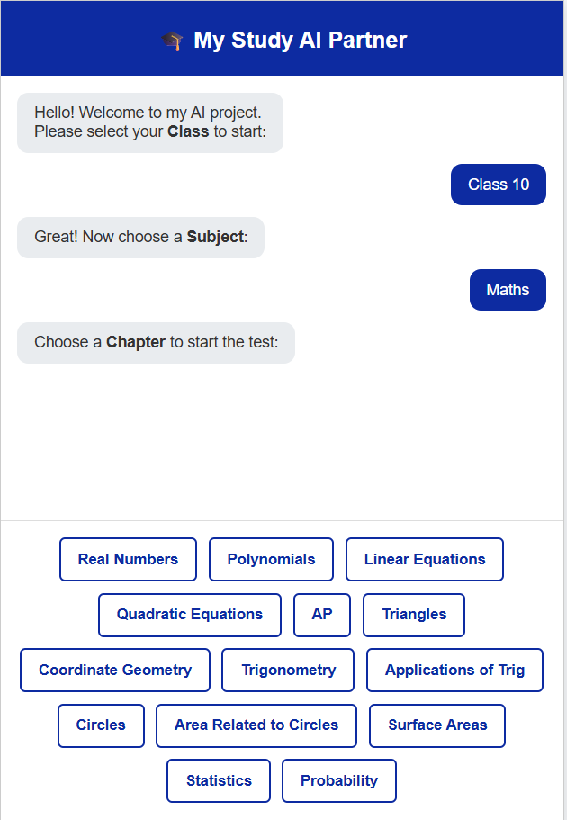

# 🎯 ExamPrepAI

An AI-powered smart test platform for students (Class 8–12).

ExamPrepAI helps students evaluate their preparation using
chapter-wise tests generated from previous year question analysis.

---

## 🚀 Features

✅ Class Selection (8th – 12th)  
✅ Subject Selection  
✅ Chapter-wise Test  
✅ Custom Number of Questions  
✅ Questions based on Previous 10-Year Trends  
✅ Performance Evaluation  
✅ Smart Learning Recommendation (YouTube Links)

---

## 🧠 How It Works

1️⃣ Student selects their **Class**  
2️⃣ Chooses **Subject**  
3️⃣ Selects **Chapter**  
4️⃣ Chooses number of **Questions**  
5️⃣ AI generates smart test  
6️⃣ Student submits answers  
7️⃣ Score calculated  
8️⃣ If score is low → Learning resources suggested 🎥

---

## 💡 Purpose of This Project

This project aims to:

✔ Help students self-evaluate  
✔ Reduce exam anxiety  
✔ Provide smart practice  
✔ Guide weak areas  
✔ Combine AI + Education

---

## 🛠 Tech Stack

- Python (Flask)
- HTML / CSS / JavaScript
- OpenAI API
- YouTube Learning Integration

---

## 📸 Screenshots



---

## ⚙️ Setup Instructions

```bash
git clone https://github.com/yourusername/exam-prep-ai.git
cd exam-prep-ai
pip install -r requirements.txt
python app.py
